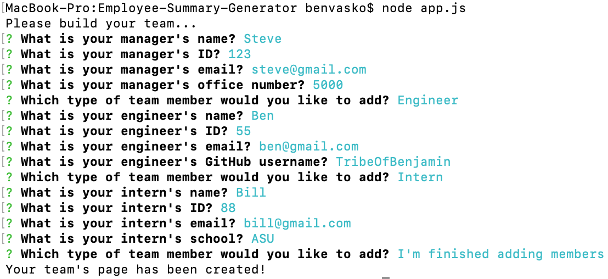
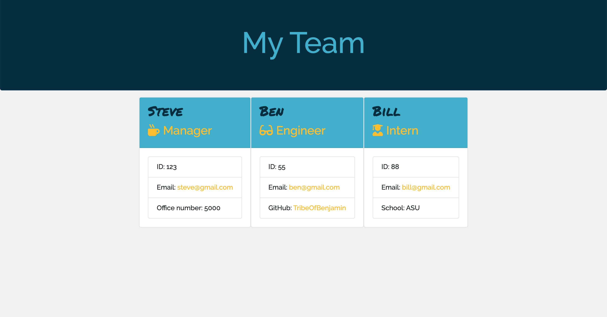

 

# Employee-Summary-Generator

I created a command line application which displays a software engineering team using inputs from the user. Each team has one manager and any combination of engineers and interns. Unique details for each team member are displayed as well. When the user is finished building his/her team, an HTML file is created which displays the team roster based on the information provided by the user.
                

## Table of Contents
                

- [Installation](#installation)

- [Usage](#usage)

- [License](#license)

- [Author](#author)
                    

## Installation

`npm i inquirer`
        

## Usage
`node app.js`    
Upon competion open team.html in the output folder to view your newly created team roster.  
  

## License

This project is ISC licensed.
        

## Author

- Benjamin Vasko

